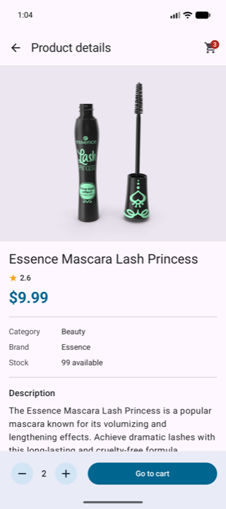
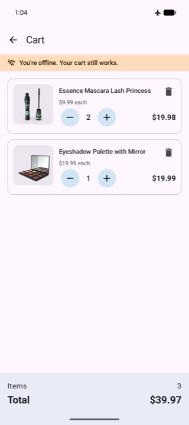
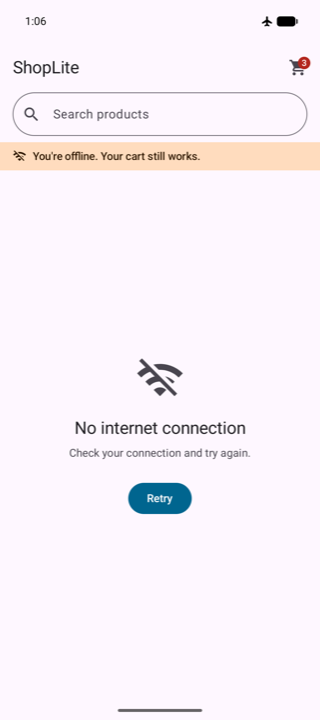

# SpireLab-eCommerce-Assessment

**ShopLite** is a small Android app that browses products from the [DummyJSON Products API](https://dummyjson.com/docs/products)
and keeps a shopping cart on the device. The cart works fully offline and survives app restarts.

| Product list | Product details | Cart (offline) | No connection |
|---|---|---|---|
|  |  |  |  |

## Features

- **Product listing**: a paginated grid showing each product's image, name, price and rating. It handles loading, empty,
  error and retry states. If loading the next page fails, the error and a retry button appear inline at the end of the grid.
- **Search**: search runs on the server as you type. Input is debounced (400 ms), and a new query cancels any request still in flight.
  An empty result shows a dedicated "No results" state.
- **Product details**: shows the image, name, description, price, rating, category, brand and stock. You can add the
  product to the cart and change its quantity from this screen.
- **Cart**: increase or decrease quantities (capped at the available stock), remove items with *Undo*, and see the total
  item count and total price. A cart badge in the top bar shows the item count.
- **Offline support**: the cart reads and writes only from local storage (Room), so viewing, changing quantities, removing
  items and viewing totals all work in airplane mode. An offline banner appears on every screen, and failed requests
  retry automatically when the connection comes back.

## Setup and build

Requirements:

- Android Studio 2026.1 or newer (AGP 9.4)
- JDK 17+ (the Gradle toolchain targets 17)
- Android SDK platform 37 (`compileSdk`/`targetSdk` 37, `minSdk` 24)

```bash
git clone <repo-url>
cd SpireLab-eCommerce-Assessment
./gradlew assembleDebug          # build the debug APK
./gradlew installDebug           # install on a connected device/emulator
./gradlew testDebugUnitTest      # JVM unit tests
./gradlew connectedDebugAndroidTest  # Room instrumented tests (needs a device/emulator)
```

You can also open the project in Android Studio and run the `app` configuration. No API key is needed. The base URL
is set as the `API_BASE_URL` BuildConfig field in `app/build.gradle.kts`.

The `release` build type has R8 minification and resource shrinking turned on. It is signed with the debug keystore so the
release APK can be installed directly for testing.

Retrofit, OkHttp, kotlinx.serialization, Room, Hilt and Coil ship their own R8 rules, which cover everything the app loads
by reflection. That includes the Navigation 3 back stack, which is restored after process death through kotlinx.serialization.
`app/proguard-rules.pro` therefore only keeps source file names and line numbers, so release crash stack traces can be
decoded with `app/build/outputs/mapping/release/mapping.txt`.

## Architecture

The app is a single Activity built with Jetpack Compose. It uses **MVVM** with **unidirectional data flow** and a
**repository** layer, and Hilt wires everything together.

```
UI (Compose screens)  ──events──▶  ViewModel  ──calls──▶  Repository interface (domain)
        ▲                              │                         │
        └──────── StateFlow<UiState> ◀─┘          ┌──────────────┴──────────────┐
                                                  ▼                             ▼
                                     DefaultProductRepository        OfflineCartRepository
                                     (Retrofit + Paging 3)           (Room, source of truth)
```

```
com.pratikbharad.shoplite
├── domain
│   ├── model         Product, Cart/CartItem, DataError (plain Kotlin)
│   └── repository    ProductRepository, CartRepository (interfaces)
├── data
│   ├── remote        ProductApi (Retrofit), DTOs + mappers, ProductPagingSource, apiCall error mapping
│   ├── local         Room database, CartDao, CartItemEntity
│   ├── repository    DefaultProductRepository, OfflineCartRepository
│   └── network       NetworkMonitor (ConnectivityManager callback → Flow<Boolean>)
├── di                Hilt modules (network, database, bindings)
├── navigation        Type-safe Navigation 3 destinations
└── ui
    ├── products      ProductListScreen + ProductListViewModel
    ├── details       ProductDetailsScreen + ProductDetailsViewModel (assisted-injected product id)
    ├── cart          CartScreen + CartViewModel
    ├── components    Reusable composables (image, rating, stepper, status views, offline banner)
    └── theme
```

- ViewModels expose a single `StateFlow` UI state, or `PagingData` for the list. Screens are split into a stateful entry
  point and a stateless `…Content` composable, which makes previews straightforward.
- `AppViewModel` holds app-wide state: whether the device is offline and the cart item count. The navigation host passes
  these down to each screen.
- The UI and ViewModels depend only on the domain interfaces. Hilt binds the implementations, and tests replace them with
  in-memory fakes.

## Libraries

| Area | Library |
|---|---|
| UI | Jetpack Compose (BOM 2026.09.00), Material 3 |
| Navigation | Navigation 3 (`navigation3-runtime/ui` 1.2.0, `lifecycle-viewmodel-navigation3`) |
| Async | Kotlin Coroutines & Flow |
| DI | Hilt 2.60.1 (+ `hilt-lifecycle-viewmodel-compose`, assisted injection) |
| Networking | Retrofit 3, OkHttp 5 (+ logging interceptor in debug), kotlinx.serialization |
| Pagination | Paging 3 (`paging-compose`) |
| Persistence | Room 2.8 (KSP, exported schema) |
| Images | Coil 3 (`coil-compose`, `coil-network-okhttp`) |
| Tests | JUnit 4, kotlinx-coroutines-test, `paging-testing`, AndroidX Test (instrumented Room tests) |

Toolchain: Kotlin 2.4.20, AGP 9.4.1 with built-in Kotlin, KSP 2.3.12, Gradle 9.6.1.

## Local storage approach

The cart lives in a Room database (`shoplite.db`) with a single `cart_items` table:

| Column | Notes |
|---|---|
| `productId` (PK) | One row per product |
| `title`, `thumbnailUrl` | Snapshot so the cart can render without the network |
| `unitPriceCents` | Price stored as a `Long` in cents |
| `stock` | Upper bound for the quantity |
| `quantity` | Always ≥ 1 (a row is deleted rather than set to 0) |
| `addedAt` | Keeps a stable order and lets *Undo* restore an item to its original position |

- **Room is the single source of truth.** Screens observe `Flow<List<CartItemEntity>>`, so any change, from any screen,
  updates the cart, the badge and the totals right away.
- **Quantity rules are enforced in the database.** Increase and decrease are single bounded `UPDATE` statements
  (`quantity < stock`, `quantity > 1`). "Add or increment" and "decrement or delete" run as `@Transaction` DAO methods,
  so rapid taps cannot push a quantity past its limits.
- **Each item stores a snapshot of its product.** When you add a product, the item records the product's details at that
  moment, so the cart needs no network calls. Adding the same product again from the details screen refreshes that snapshot.
- **Images work offline after the first view.** Product thumbnails come from Coil's disk cache. Any image already shown
  while online also appears in the cart while offline.
- The Room schema is exported to `app/schemas` so future migrations can be checked.

## Important design decisions

- **Prices are stored as integer cents.** The API returns prices as doubles. They are converted once, at the API
  boundary, to `Long` cents, so line totals and the cart total never accumulate floating-point error. Display formatting
  uses the device locale with USD as the currency.
- **Errors are typed at the data boundary.** `apiCall {}` converts OkHttp, Retrofit and serialization exceptions into a
  small `DataError` enum: `NO_CONNECTION`, `TIMEOUT`, `NOT_FOUND`, `SERVER` and `UNKNOWN`. The UI never sees network
  exception types. It maps each `DataError` to a title, a message and a retry action. Coroutine cancellation is always
  rethrown, never reported as an error.
- **Paging 3 handles the list and search.** DummyJSON uses `limit`/`skip`, which maps directly onto an offset-keyed
  `PagingSource`. Paging's `LoadState` covers the loading, error, empty and retry states the brief asks for, with little
  custom state code.
- **Search state lives in `TextFieldState`.** The query is observed with `snapshotFlow`, then passed through `debounce`
  and `distinctUntilChanged`, and finally `flatMapLatest` swaps in a new pager. This keeps typing responsive and
  cancels stale requests.
- **Removal is consistent everywhere.** Decreasing the quantity below 1 removes the item, the same way on the details
  screen and in the cart. The cart also has an explicit remove button, and both kinds of removal in the cart offer
  *Undo* through a snackbar.
- **The app reacts to connectivity.** `NetworkMonitor` drives the offline banner and automatically retries a failed
  product list or details request when the device reconnects. Cart operations never touch the network.
- **There is no separate use-case layer.** The business rules are small: quantity limits live in the DAO and totals in
  the `Cart` model. A use-case layer would only forward calls.
- **Icons are vector drawables.** The few icons the app needs are Material icons stored as drawables, rather than pulling
  in the large `material-icons-extended` artifact.

## Testing

- **JVM unit tests** (`app/src/test`):
  - `ApiCallTest`: maps exceptions to `DataError` and checks that cancellation is rethrown.
  - `ProductDtoTest`: tolerates missing fields and converts prices to cents.
  - `ProductPagingSourceTest`: covers paging keys, end of data, use of the search endpoint, and error results (`TestPager`).
  - `CartTest`: checks the totals and the stock cap.
  - `FormattingTest`: checks price and category formatting.
  - `ProductDetailsViewModelTest`: covers loading, error then retry, add-to-cart capped at stock, and removing the last unit.
  - `CartViewModelTest`: covers totals, quantity changes, removal and undo.
- **Instrumented tests** (`app/src/androidTest`): `OfflineCartRepositoryTest` runs against an in-memory Room database.
  It checks increment and stock capping, out-of-stock rejection, totals, the decrement-to-delete rule, and restoring an item.

## Known limitations

- **Only the cart is available offline.** The product catalog is not cached, so the list and details screens show a
  "No internet connection" state with *Retry* when offline. A cached catalog would need a Paging `RemoteMediator`
  backed by Room.
- **Cart prices are not re-checked against the server.** An item keeps the price and stock from when it was added. They
  update only when the product is added again from the details screen.
- **There is no checkout and no server-side cart.** DummyJSON cart writes are simulated, so the cart is local only.
- **There is no category filter or sorting**, even though the API offers a categories endpoint. The brief did not require
  them, and they are a natural next step.
- **Cart images may be missing offline.** A thumbnail never loaded while online shows a placeholder until the device
  reconnects.
- **The layout is phone-first.** The grid adds columns on wider screens, but there is no dedicated list-detail layout
  for tablets or foldables.
- **The query is not kept after process death.** The back stack is restored, but the search text resets.
